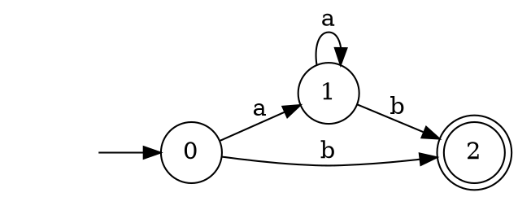

## re-nfa: convert regular expressions to NFAs

This repository provides a library and executable for converting
regular expressions into nondeterministic finite automata (NFAs) using
[Glushkov's construction][glushkov], and for formatting the NFAs using
[DOT][DOT] so that they can be displayed using [graphviz][graphviz].

### The `re-nfa` executable

The `re-nfa` executable accepts a single regular expression argument
and prints a [DOT][DOT] graph for the corresponding NFA to standard
output.  For example, the following command

```
re-nfa "a*b"
```

produces the following output.



On a Unix system you might pipe the output directly to `dot`, and then
on to [`display`][display], like this:

```bash
re-nfa "a*b" | dot -Tpng | display
```

to display the following graph:


Here is a more complex graph constructed from the regex `a?a?a?aaa` that causes pathological backtracking behaviour in some engines, as described in Russ Cox's article [Regular Expression Matching Can Be Simple And Fast][simple-and-fast]:


### Library

This repository also provides a library interface.  The [`Regex`][regex] module provides an [`ocaml-re`][ocaml-re]-style combinator interface for constructing regular expressions

```ocaml
seq (star (chr 'a')) (chr 'b')     (* a*b *)
```

as well as functions `parse` and `compile` for building a regular
expression from a string and for turning a regular expression into an
NFA.


```ocaml
val parse : string -> t
val compile : t -> Nfa.nfa
```


The [`Nfa`][nfa] module provides a function for testing whether an NFA
accepts a string (represented as a list of characters):

```ocaml
val accept : Nfa.t -> char list -> bool
```

The [`Nfa_dot`][nfa_dot] module provides functions for converting NFAs
to DOT directed graphs and for pretty-printing the graphs:


```ocaml
val digraph_of_nfa : Nfa.nfa -> digraph
val format_digraph : Format.formatter -> digraph -> unit
```

### Rationale

The code in this repository is an extracted and extended portion of
an exercise from a 2018 [advanced functional programming course][afp-exercises].
If you're interested in learning MetaOCaml then you may enjoy
completing the original exercise, perhaps after reading the
[course notes][afp-notes].

Knowing the provenance of the code helps in understanding some of the
choices made.

For example, there are several algorithms for constructing NFAs, but
Glushkov's has a property that turns out to be convenient for the
exercise: it constructs an automaton without ε-transitions.

Additionally, the code here is not especially efficient; the remainder
of the original exercise involves using multi-stage programming to
turn the rather inefficient NFA interpreter into a compiler that
produces rather efficient code --- typically more efficient than
production regex engines.  (Similar transformations using
[Scala LMS][lms] are also described in the literature: see
[Optimizing data structures in high-level programs: New directions for extensible compilers based on staging][rompf2013] (Rompf et al. 2013))

### Installation

The `re-nfa` library and executable can be installed via [`OPAM`][opam] by
pinning this repository:

```
opam pin add re-nfa https://github.com/yallop/ocaml-re-nfa.git
```


[glushkov]: https://en.wikipedia.org/wiki/Glushkov%27s_construction_algorithm
[DOT]: https://en.wikipedia.org/wiki/DOT_(graph_description_language)
[graphviz]: https://graphviz.org/
[ocaml-re]: https://github.com/ocaml/ocaml-re
[display]: http://imagemagick.sourceforge.net/http/www/display.html
[simple-and-fast]: https://swtch.com/~rsc/regexp/regexp1.html
[afp-exercises]: https://www.cl.cam.ac.uk/teaching/1718/L28/assessment.html
[afp-notes]: https://www.cl.cam.ac.uk/teaching/1718/L28/materials.html
[lms]: https://scala-lms.github.io/
[rompf2013]: http://citeseerx.ist.psu.edu/viewdoc/summary?doi=10.1.1.301.2782
[opam]: https://opam.ocaml.org/
[regex]: https://github.com/yallop/ocaml-re-nfa/blob/master/lib/regex.mli
[ocaml-re]: https://github.com/ocaml/ocaml-re
[nfa]: https://github.com/yallop/ocaml-re-nfa/blob/master/lib/nfa.mli
[nfa_dot]: https://github.com/yallop/ocaml-re-nfa/blob/master/lib/nfa_dot.mli

